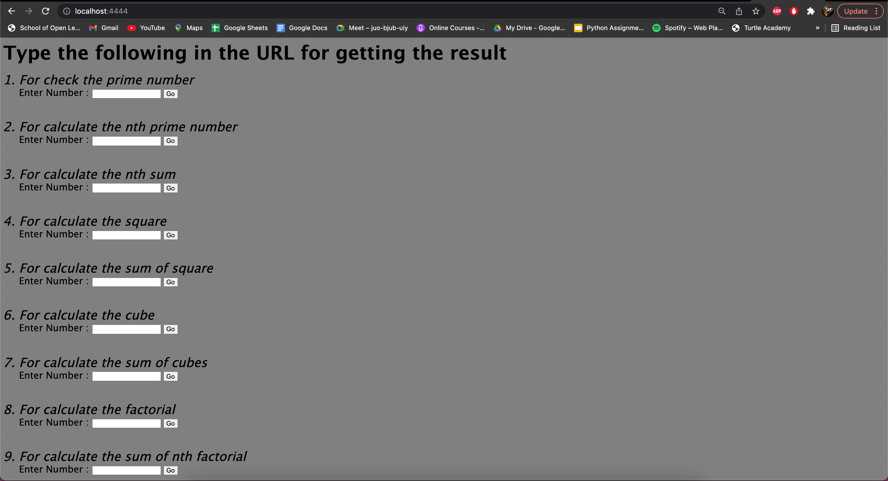

# Simple question answer server

This is a simple question answer server. The questions type are predefined such as: \
       •› nth prime \
       •› sum of squares \
       •› sum of factorial \
       •› sum of cubes \
       •› number is prime or not \
       •› nth sum \
       •› square \
       •› cube \
       •› factorial 

## Screenshot

